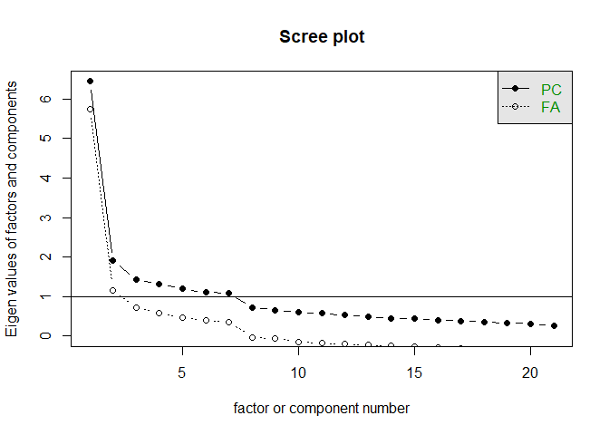
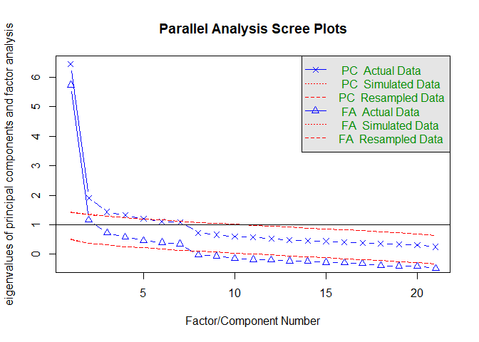
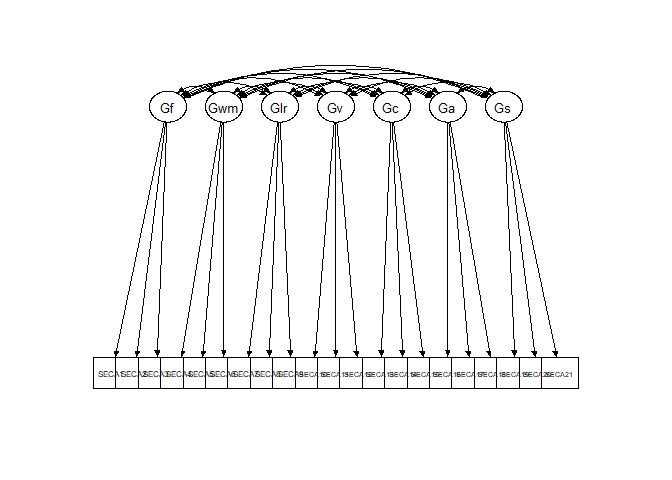
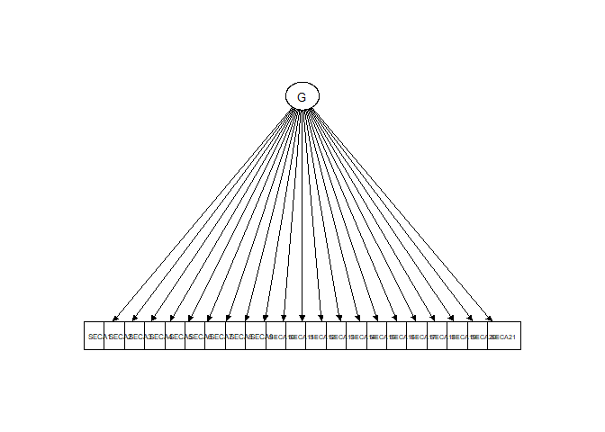
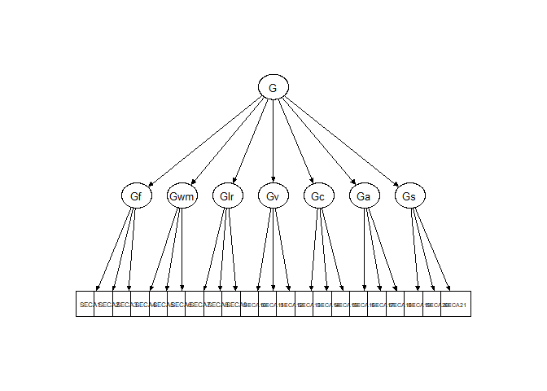

# Introduction
This paper outlines the development and initial validation of the Self-Report Cognitive Abilities Questionnaire (SRCAQ), a brief measure designed to assess cognitive functioning in the ability areas of Fluid Reasoning (Gf), Short-term Working Memory (Gwm), Long Term Storage, and Retrieval (Glr), Comprehension Knowledge (Gc), Processing Speed (Gs), Auditory Processing (Ga), and Visual Processing (Gv). 
This study is important for several reasons: 
1) There is no brief measure of self-report cognitive abilities that capture comprehensive cognitive abilities based on CHC theory. Most measures used multiple intelligence framework as a theory foundation and the only exist measure of self-reported cognitive abilities based on CHC theory only assess three narrow abilities: Gf, Gc, and Gv (Jacobs & Roodenburg, 2014).
2) None of the existing instruments investigated the measurement invariance across sex, despite many studies compared self-reported cognitive abilities across gender.
3) Self-report cognitive ability is a construct that is closely related to other construct such as metacognition and personality. This measure could be useful to make further investigation of the relation between objective cognitive ability, metacognition, and personality.

# Data analysis
This is data anaylsis section of the development of SRCAQ. In study 1, EFA was performed to explore dimensionality of the measure. Overal scale and each subscale then assessed their reliability by using Cronbach's Alpha. In study 2, CFA was performed to confirm the structure model. There were three model compared: seven factor model, unidimensi model, and second-order model. Validity then assessed by correlating with external measure (Self-estimated cognitive abilities).

## Calling library

```r
library(tidyverse)
```

```
## -- Attaching packages --------------------------------------- tidyverse 1.3.0 --
```

```
## v ggplot2 3.3.3     v purrr   0.3.4
## v tibble  3.1.1     v dplyr   1.0.6
## v tidyr   1.1.3     v stringr 1.4.0
## v readr   1.4.0     v forcats 0.5.1
```

```
## Warning: package 'tibble' was built under R version 4.0.5
```

```
## Warning: package 'dplyr' was built under R version 4.0.5
```

```
## -- Conflicts ------------------------------------------ tidyverse_conflicts() --
## x dplyr::filter() masks stats::filter()
## x dplyr::lag()    masks stats::lag()
```

```r
library(psych)
```

```
## Warning: package 'psych' was built under R version 4.0.5
```

```
## 
## Attaching package: 'psych'
```

```
## The following objects are masked from 'package:ggplot2':
## 
##     %+%, alpha
```

```r
library(lavaan)
```

```
## Warning: package 'lavaan' was built under R version 4.0.5
```

```
## This is lavaan 0.6-8
## lavaan is FREE software! Please report any bugs.
```

```
## 
## Attaching package: 'lavaan'
```

```
## The following object is masked from 'package:psych':
## 
##     cor2cov
```

```r
library(semTools)
```

```
## Warning: package 'semTools' was built under R version 4.0.5
```

```
## 
```

```
## ###############################################################################
```

```
## This is semTools 0.5-4
```

```
## All users of R (or SEM) are invited to submit functions or ideas for functions.
```

```
## ###############################################################################
```

```
## 
## Attaching package: 'semTools'
```

```
## The following object is masked from 'package:psych':
## 
##     skew
```

```
## The following object is masked from 'package:readr':
## 
##     clipboard
```

```r
library(ggplot2)
library(semPlot)
```

```
## Warning: package 'semPlot' was built under R version 4.0.5
```


## Data preparation

```r
setwd("E:/Google Drive UMM/PhD ELTE/Git/SRCAQ21")
# Reading data
study1 <- read.csv("study1(n=412).csv")
study2 <- read.csv("study2(n=405).csv")
```

## Creating dataset for items

```r
items_study1<- study1 %>% 
  select(starts_with("SECA"))
items_study2 <- study2 %>% 
  select(starts_with("SECA"))
```

# Study 1: Initial validation of SRCAQ-21

## Exploratory Data Analysis

```r
describe(study1)
```

```
##           vars   n  mean   sd median trimmed  mad min max range  skew kurtosis
## Sex*         1 412  1.47 0.50   1.00    1.46 0.00   1   2     1  0.12    -1.99
## Age          2 412 19.34 1.12  19.00   19.23 1.48  17  26     9  1.49     4.90
## Domicile*    3 412  1.31 0.46   1.00    1.26 0.00   1   2     1  0.84    -1.30
## Major*       4 412  1.61 0.75   1.00    1.51 0.00   1   3     2  0.78    -0.82
## GPA          5 412  3.49 0.33   3.55    3.51 0.31   2   4     2 -0.90     0.96
## SECA1        6 412  3.54 0.80   4.00    3.55 1.48   1   5     4 -0.28     0.13
## SECA2        7 412  3.58 0.80   4.00    3.58 1.48   1   5     4 -0.30     0.19
## SECA3        8 412  3.18 0.87   3.00    3.15 1.48   1   5     4  0.18    -0.28
## SECA4        9 412  3.26 1.01   3.00    3.24 1.48   1   5     4 -0.02    -0.59
## SECA5       10 412  3.65 0.91   4.00    3.70 1.48   1   5     4 -0.34    -0.34
## SECA6       11 412  3.10 0.93   3.00    3.11 1.48   1   5     4 -0.08    -0.46
## SECA7       12 412  3.27 0.89   3.00    3.25 1.48   1   5     4  0.02    -0.19
## SECA8       13 412  3.85 0.98   4.00    3.95 1.48   1   5     4 -0.57    -0.40
## SECA9       14 412  3.78 1.08   4.00    3.88 1.48   1   5     4 -0.56    -0.60
## SECA10      15 412  3.71 0.99   4.00    3.79 1.48   1   5     4 -0.44    -0.35
## SECA11      16 412  3.49 1.01   4.00    3.52 1.48   1   5     4 -0.31    -0.49
## SECA12      17 412  3.81 1.02   4.00    3.90 1.48   1   5     4 -0.47    -0.56
## SECA13      18 412  3.51 0.92   3.00    3.53 1.48   1   5     4 -0.07    -0.41
## SECA14      19 412  3.37 0.81   3.00    3.38 1.48   1   5     4  0.03     0.01
## SECA15      20 412  3.70 0.84   4.00    3.69 1.48   1   5     4 -0.06    -0.44
## SECA16      21 412  3.04 0.98   3.00    3.02 1.48   1   5     4  0.06    -0.43
## SECA17      22 412  3.64 0.96   4.00    3.69 1.48   1   5     4 -0.40    -0.32
## SECA18      23 412  2.98 1.10   3.00    2.95 1.48   1   5     4  0.16    -0.68
## SECA19      24 412  3.45 0.95   3.00    3.47 1.48   1   5     4 -0.23    -0.26
## SECA20      25 412  3.28 0.93   3.00    3.26 1.48   1   5     4  0.01    -0.26
## SECA21      26 412  3.24 1.05   3.00    3.24 1.48   1   5     4 -0.13    -0.60
##             se
## Sex*      0.02
## Age       0.06
## Domicile* 0.02
## Major*    0.04
## GPA       0.02
## SECA1     0.04
## SECA2     0.04
## SECA3     0.04
## SECA4     0.05
## SECA5     0.05
## SECA6     0.05
## SECA7     0.04
## SECA8     0.05
## SECA9     0.05
## SECA10    0.05
## SECA11    0.05
## SECA12    0.05
## SECA13    0.05
## SECA14    0.04
## SECA15    0.04
## SECA16    0.05
## SECA17    0.05
## SECA18    0.05
## SECA19    0.05
## SECA20    0.05
## SECA21    0.05
```

```r
prop.table(table(study1$Sex))
```

```
## 
##    Female      Male 
## 0.5291262 0.4708738
```

```r
prop.table(table(study1$Domicile))
```

```
## 
##      Jawa Luar Jawa 
## 0.6941748 0.3058252
```
Skewness and kurtosis of all items are below 1.00, indicating univariate normality. 

## EFA
### Create the correlation matrix

```r
cor_matrix <- lowerCor(items_study1)
```

```
##        SECA1 SECA2 SECA3 SECA4 SECA5 SECA6 SECA7 SECA8 SECA9 SECA10 SECA11
## SECA1  1.00                                                               
## SECA2  0.53  1.00                                                         
## SECA3  0.42  0.49  1.00                                                   
## SECA4  0.23  0.22  0.40  1.00                                             
## SECA5  0.25  0.27  0.29  0.50  1.00                                       
## SECA6  0.29  0.23  0.37  0.58  0.53  1.00                                 
## SECA7  0.19  0.09  0.27  0.36  0.34  0.39  1.00                           
## SECA8  0.26  0.16  0.17  0.23  0.20  0.27  0.47  1.00                     
## SECA9  0.21  0.09  0.14  0.20  0.24  0.22  0.45  0.61  1.00               
## SECA10 0.26  0.16  0.23  0.28  0.21  0.30  0.27  0.31  0.31  1.00         
## SECA11 0.27  0.20  0.23  0.23  0.16  0.21  0.22  0.29  0.25  0.69   1.00  
## SECA12 0.15  0.09  0.16  0.21  0.24  0.16  0.21  0.31  0.25  0.50   0.46  
## SECA13 0.20  0.22  0.19  0.25  0.33  0.28  0.32  0.16  0.24  0.19   0.29  
## SECA14 0.38  0.35  0.33  0.31  0.34  0.33  0.29  0.19  0.24  0.29   0.33  
## SECA15 0.33  0.24  0.28  0.29  0.34  0.34  0.22  0.20  0.18  0.24   0.24  
## SECA16 0.24  0.24  0.25  0.29  0.26  0.36  0.23  0.22  0.22  0.29   0.28  
## SECA17 0.24  0.30  0.20  0.28  0.26  0.27  0.22  0.32  0.29  0.36   0.40  
## SECA18 0.20  0.19  0.20  0.23  0.21  0.26  0.21  0.25  0.31  0.31   0.36  
## SECA19 0.20  0.22  0.21  0.30  0.30  0.29  0.16  0.12  0.16  0.16   0.18  
## SECA20 0.21  0.24  0.27  0.29  0.29  0.27  0.19  0.15  0.13  0.11   0.11  
## SECA21 0.22  0.24  0.23  0.22  0.17  0.19  0.11  0.12  0.06  0.18   0.17  
##        SECA12 SECA13 SECA14 SECA15 SECA16 SECA17 SECA18 SECA19 SECA20 SECA21
## SECA12 1.00                                                                 
## SECA13 0.30   1.00                                                          
## SECA14 0.28   0.61   1.00                                                   
## SECA15 0.25   0.45   0.54   1.00                                            
## SECA16 0.19   0.27   0.30   0.31   1.00                                     
## SECA17 0.28   0.33   0.33   0.35   0.54   1.00                              
## SECA18 0.25   0.29   0.28   0.22   0.45   0.56   1.00                       
## SECA19 0.21   0.34   0.37   0.27   0.25   0.28   0.23   1.00                
## SECA20 0.14   0.28   0.34   0.27   0.23   0.20   0.14   0.59   1.00         
## SECA21 0.13   0.12   0.21   0.21   0.15   0.10   0.06   0.32   0.35   1.00
```

### Asumption check
#### Calculate the KMO score.

```r
KMO(cor_matrix)
```

```
## Kaiser-Meyer-Olkin factor adequacy
## Call: KMO(r = cor_matrix)
## Overall MSA =  0.86
## MSA for each item = 
##  SECA1  SECA2  SECA3  SECA4  SECA5  SECA6  SECA7  SECA8  SECA9 SECA10 SECA11 
##   0.88   0.80   0.88   0.90   0.90   0.88   0.88   0.79   0.82   0.81   0.83 
## SECA12 SECA13 SECA14 SECA15 SECA16 SECA17 SECA18 SECA19 SECA20 SECA21 
##   0.87   0.85   0.89   0.91   0.91   0.87   0.89   0.84   0.83   0.89
```

#### Bartlett's sphericity test

```r
cortest.bartlett(cor_matrix, n = 412)
```

```
## $chisq
## [1] 3151.502
## 
## $p.value
## [1] 0
## 
## $df
## [1] 210
```
The Kaiser–Meyer–Olkin (KMO) measure of sampling adequacy index was .86 and Bartlett's test of sphericity was significant (p < .001) suggesting that the sample was suitable for factor analysis. 

### Create scree plot
Create a scree plot to help the decision on how many factors to include

```r
scree(items_study1)
```

<!-- -->

```r
fa.parallel(items_study1)
```

<!-- -->

```
## Parallel analysis suggests that the number of factors =  7  and the number of components =  4
```

### Run the factor analysis with 7 factors.

```r
fa_7 <- fa(items_study1, nfactors = 7, fm = "pa", rotate = "promax")
```

```
## Loading required namespace: GPArotation
```

```r
print(fa_7$loadings, cutoff = 0.3)
```

```
## 
## Loadings:
##        PA6    PA2    PA1    PA3    PA4    PA5    PA7   
## SECA1                               0.688              
## SECA2                               0.821              
## SECA3                               0.520              
## SECA4   0.769                                          
## SECA5   0.598                                          
## SECA6   0.833                                          
## SECA7   0.336                0.489                     
## SECA8                        0.835                     
## SECA9                        0.766                     
## SECA10         0.917                                   
## SECA11         0.789                                   
## SECA12         0.532                                   
## SECA13                0.844                            
## SECA14                0.779                            
## SECA15                0.494                            
## SECA16                                     0.590       
## SECA17                                     0.786       
## SECA18                                     0.636       
## SECA19                                            0.756
## SECA20                                            0.807
## SECA21                                            0.400
## 
##                  PA6   PA2   PA1   PA3   PA4   PA5   PA7
## SS loadings    1.918 1.803 1.688 1.564 1.560 1.444 1.405
## Proportion Var 0.091 0.086 0.080 0.074 0.074 0.069 0.067
## Cumulative Var 0.091 0.177 0.258 0.332 0.406 0.475 0.542
```
The principal axis factoring extraction method in combination with Promax rotation was used, since permitting the factors to correlate was logically justified. Parallel analysis was conducted indicating a seven-factor solution. Item were distributed to their intended factors.

### Alpha cronbach

```r
alpha.All <- alpha(items_study1[, 1:21])
alpha.Gf <- alpha(items_study1[, 1:3])
alpha.Gwm <- alpha(items_study1[, 4:6])
alpha.Glr <- alpha(items_study1[, 7:9])
alpha.Gv <- alpha(items_study1[, 10:12])
alpha.Gc <- alpha(items_study1[, 13:15])
alpha.Ga <- alpha(items_study1[, 16:18])
alpha.Gs <- alpha(items_study1[, 19:21])
```
Cronbach’s Alpha for item groups for Gf, Gwm, Glr, Gv, Gc, Ga, and Gs α = .73, α = .78, α = .76, α = .78, α = .77,  α = .76, and  α = .68 respectively. Cronbach’s Alpha for all items α = 88.

## Conclusion of Study 1
Study 1 found that SRCAQ could be better explained by using seven-factors model. It was anticipated that a seven-factor solution would describe the data, which was consistent with the theoretical basis proposed. Cronbach's Alpha of each subscale were acceptable (> .70), except for Gs.


# Study 2: Confirmatory Factor Analysis
## Exploratory Data Analysis

```r
describe(study2)
```

```
##           vars   n   mean    sd median trimmed   mad   min max range  skew
## Sex*         1 405   1.43  0.50    1.0    1.41  0.00  1.00   2  1.00  0.29
## Age          2 405  19.38  1.20   19.0   19.23  1.48 18.00  29 11.00  2.48
## Domicile*    3 405   1.32  0.47    1.0    1.27  0.00  1.00   2  1.00  0.79
## Major*       4 405   1.73  0.81    2.0    1.66  1.48  1.00   3  2.00  0.53
## GPA          5 405   3.45  0.38    3.5    3.48  0.31  1.02   4  2.98 -1.64
## SECA1        6 405   3.42  0.82    3.0    3.43  1.48  1.00   5  4.00 -0.08
## SECA2        7 405   3.50  0.81    4.0    3.51  1.48  1.00   5  4.00 -0.14
## SECA3        8 405   3.20  0.89    3.0    3.17  1.48  1.00   5  4.00  0.12
## SECA4        9 405   3.21  1.03    3.0    3.20  1.48  1.00   5  4.00 -0.17
## SECA5       10 405   3.66  0.91    4.0    3.71  1.48  1.00   5  4.00 -0.38
## SECA6       11 405   3.15  0.97    3.0    3.14  1.48  1.00   5  4.00 -0.07
## SECA7       12 405   3.23  0.96    3.0    3.19  1.48  1.00   5  4.00  0.05
## SECA8       13 405   3.77  1.08    4.0    3.86  1.48  1.00   5  4.00 -0.56
## SECA9       14 405   3.76  1.13    4.0    3.85  1.48  1.00   5  4.00 -0.52
## SECA10      15 405   3.71  1.00    4.0    3.79  1.48  1.00   5  4.00 -0.44
## SECA11      16 405   3.54  0.98    4.0    3.58  1.48  1.00   5  4.00 -0.27
## SECA12      17 405   3.61  1.04    4.0    3.66  1.48  1.00   5  4.00 -0.37
## SECA13      18 405   3.45  0.87    3.0    3.46  1.48  1.00   5  4.00 -0.03
## SECA14      19 405   3.32  0.75    3.0    3.34  0.00  1.00   5  4.00  0.12
## SECA15      20 405   3.65  0.81    4.0    3.65  1.48  1.00   5  4.00 -0.27
## SECA16      21 405   3.13  0.94    3.0    3.12  1.48  1.00   5  4.00 -0.04
## SECA17      22 405   3.64  0.94    4.0    3.69  1.48  1.00   5  4.00 -0.38
## SECA18      23 405   2.94  1.05    3.0    2.90  1.48  1.00   5  4.00  0.23
## SECA19      24 405   3.52  0.89    4.0    3.55  1.48  1.00   5  4.00 -0.21
## SECA20      25 405   3.37  0.95    3.0    3.36  1.48  1.00   5  4.00  0.04
## SECA21      26 405   3.31  1.01    3.0    3.29  1.48  1.00   5  4.00  0.05
## SE.Gf       27 405 105.73 17.36   99.0  105.96 25.20 74.00 132 58.00  0.01
## SE.Gwm      28 405 102.81 18.65   94.0  102.73 20.76 71.00 149 78.00  0.17
## SE.Glr      29 405 100.07 17.14   93.0   99.34 13.34 72.00 131 59.00  0.51
## SE.Gv       30 405 110.73 17.47  121.0  111.95 10.38 74.00 144 70.00 -0.49
## SE.Gc       31 405 105.00 17.74   96.0  105.04 20.76 71.00 133 62.00  0.09
## SE.Ga       32 405  99.90 18.06   93.0   99.21 16.31 69.00 133 64.00  0.45
## SE.Gs       33 405 103.39 17.81   95.0  103.25 19.27 70.00 131 61.00  0.20
## SR.Gf       34 405  10.11  2.01   10.0   10.12  1.48  3.00  15 12.00 -0.06
## SR.Gwm      35 405  10.01  2.51   10.0   10.10  2.97  3.00  15 12.00 -0.32
## SR.Glr      36 405  10.75  2.63   11.0   10.90  2.97  3.00  15 12.00 -0.54
## SR.Gv       37 405  10.87  2.53   11.0   10.97  2.97  3.00  15 12.00 -0.40
## SR.Gc       38 405  10.42  1.99   10.0   10.43  1.48  3.00  15 12.00 -0.23
## SR.Ga       39 405   9.70  2.43   10.0    9.72  2.97  3.00  15 12.00 -0.06
## SR.Gs       40 405  10.20  2.31   10.0   10.22  1.48  3.00  15 12.00 -0.14
##           kurtosis   se
## Sex*         -1.92 0.02
## Age          12.70 0.06
## Domicile*    -1.38 0.02
## Major*       -1.27 0.04
## GPA           5.53 0.02
## SECA1        -0.31 0.04
## SECA2        -0.23 0.04
## SECA3        -0.37 0.04
## SECA4        -0.67 0.05
## SECA5        -0.27 0.04
## SECA6        -0.41 0.05
## SECA7        -0.41 0.05
## SECA8        -0.47 0.05
## SECA9        -0.77 0.06
## SECA10       -0.44 0.05
## SECA11       -0.54 0.05
## SECA12       -0.65 0.05
## SECA13       -0.20 0.04
## SECA14        0.21 0.04
## SECA15        0.18 0.04
## SECA16       -0.55 0.05
## SECA17       -0.34 0.05
## SECA18       -0.62 0.05
## SECA19       -0.04 0.04
## SECA20       -0.52 0.05
## SECA21       -0.67 0.05
## SE.Gf        -1.66 0.86
## SE.Gwm       -1.60 0.93
## SE.Glr       -1.31 0.85
## SE.Gv        -1.41 0.87
## SE.Gc        -1.68 0.88
## SE.Ga        -1.41 0.90
## SE.Gs        -1.63 0.88
## SR.Gf         0.47 0.10
## SR.Gwm       -0.07 0.12
## SR.Glr        0.00 0.13
## SR.Gv        -0.01 0.13
## SR.Gc         0.82 0.10
## SR.Ga        -0.27 0.12
## SR.Gs         0.12 0.12
```

```r
prop.table(table(study2$Sex))
```

```
## 
##    Female      Male 
## 0.5728395 0.4271605
```

```r
prop.table(table(study2$Domicile))
```

```
## 
##      Jawa Luar Jawa 
## 0.6839506 0.3160494
```

## CFA
### Seven-factor model

```r
SECA.model1 <- ' 
Gf  =~ SECA1 + SECA2 + SECA3
Gwm =~ SECA4 + SECA5 + SECA6
Glr  =~ SECA7 + SECA8 + SECA9
Gv =~ SECA10 + SECA11 + SECA12
Gc =~ SECA13 + SECA14 + SECA15
Ga =~ SECA16 + SECA17 + SECA18
Gs =~ SECA19 + SECA20 + SECA21
'
fit1 <- cfa(SECA.model1, data = items_study2, std.lv=TRUE)
summary(fit1, standardized=TRUE, fit.measures=T)
```

```
## lavaan 0.6-8 ended normally after 31 iterations
## 
##   Estimator                                         ML
##   Optimization method                           NLMINB
##   Number of model parameters                        63
##                                                       
##   Number of observations                           405
##                                                       
## Model Test User Model:
##                                                       
##   Test statistic                               301.954
##   Degrees of freedom                               168
##   P-value (Chi-square)                           0.000
## 
## Model Test Baseline Model:
## 
##   Test statistic                              3412.243
##   Degrees of freedom                               210
##   P-value                                        0.000
## 
## User Model versus Baseline Model:
## 
##   Comparative Fit Index (CFI)                    0.958
##   Tucker-Lewis Index (TLI)                       0.948
## 
## Loglikelihood and Information Criteria:
## 
##   Loglikelihood user model (H0)              -9962.320
##   Loglikelihood unrestricted model (H1)      -9811.343
##                                                       
##   Akaike (AIC)                               20050.639
##   Bayesian (BIC)                             20302.884
##   Sample-size adjusted Bayesian (BIC)        20102.977
## 
## Root Mean Square Error of Approximation:
## 
##   RMSEA                                          0.044
##   90 Percent confidence interval - lower         0.036
##   90 Percent confidence interval - upper         0.052
##   P-value RMSEA <= 0.05                          0.874
## 
## Standardized Root Mean Square Residual:
## 
##   SRMR                                           0.043
## 
## Parameter Estimates:
## 
##   Standard errors                             Standard
##   Information                                 Expected
##   Information saturated (h1) model          Structured
## 
## Latent Variables:
##                    Estimate  Std.Err  z-value  P(>|z|)   Std.lv  Std.all
##   Gf =~                                                                 
##     SECA1             0.568    0.041   13.909    0.000    0.568    0.698
##     SECA2             0.591    0.040   14.636    0.000    0.591    0.730
##     SECA3             0.549    0.045   12.071    0.000    0.549    0.618
##   Gwm =~                                                                
##     SECA4             0.798    0.046   17.247    0.000    0.798    0.777
##     SECA5             0.720    0.040   17.808    0.000    0.720    0.796
##     SECA6             0.763    0.043   17.553    0.000    0.763    0.788
##   Glr =~                                                                
##     SECA7             0.666    0.047   14.292    0.000    0.666    0.694
##     SECA8             0.875    0.051   17.281    0.000    0.875    0.813
##     SECA9             0.772    0.055   14.038    0.000    0.772    0.683
##   Gv =~                                                                 
##     SECA10            0.795    0.046   17.248    0.000    0.795    0.795
##     SECA11            0.831    0.045   18.622    0.000    0.831    0.846
##     SECA12            0.633    0.051   12.508    0.000    0.633    0.610
##   Gc =~                                                                 
##     SECA13            0.591    0.042   14.026    0.000    0.591    0.678
##     SECA14            0.550    0.036   15.374    0.000    0.550    0.729
##     SECA15            0.584    0.038   15.237    0.000    0.584    0.724
##   Ga =~                                                                 
##     SECA16            0.693    0.044   15.712    0.000    0.693    0.740
##     SECA17            0.743    0.043   17.164    0.000    0.743    0.795
##     SECA18            0.695    0.051   13.739    0.000    0.695    0.665
##   Gs =~                                                                 
##     SECA19            0.699    0.042   16.529    0.000    0.699    0.790
##     SECA20            0.692    0.046   15.086    0.000    0.692    0.731
##     SECA21            0.614    0.051   12.136    0.000    0.614    0.609
## 
## Covariances:
##                    Estimate  Std.Err  z-value  P(>|z|)   Std.lv  Std.all
##   Gf ~~                                                                 
##     Gwm               0.459    0.054    8.491    0.000    0.459    0.459
##     Glr               0.407    0.058    7.028    0.000    0.407    0.407
##     Gv                0.479    0.053    8.992    0.000    0.479    0.479
##     Gc                0.662    0.047   13.975    0.000    0.662    0.662
##     Ga                0.463    0.056    8.328    0.000    0.463    0.463
##     Gs                0.532    0.053    9.973    0.000    0.532    0.532
##   Gwm ~~                                                                
##     Glr               0.574    0.046   12.498    0.000    0.574    0.574
##     Gv                0.318    0.055    5.779    0.000    0.318    0.318
##     Gc                0.562    0.048   11.727    0.000    0.562    0.562
##     Ga                0.531    0.048   11.061    0.000    0.531    0.531
##     Gs                0.499    0.050    9.913    0.000    0.499    0.499
##   Glr ~~                                                                
##     Gv                0.429    0.053    8.137    0.000    0.429    0.429
##     Gc                0.461    0.054    8.466    0.000    0.461    0.461
##     Ga                0.509    0.051    9.997    0.000    0.509    0.509
##     Gs                0.394    0.056    6.984    0.000    0.394    0.394
##   Gv ~~                                                                 
##     Gc                0.453    0.053    8.510    0.000    0.453    0.453
##     Ga                0.559    0.047   11.948    0.000    0.559    0.559
##     Gs                0.357    0.056    6.360    0.000    0.357    0.357
##   Gc ~~                                                                 
##     Ga                0.619    0.047   13.225    0.000    0.619    0.619
##     Gs                0.670    0.045   14.986    0.000    0.670    0.670
##   Ga ~~                                                                 
##     Gs                0.446    0.054    8.192    0.000    0.446    0.446
## 
## Variances:
##                    Estimate  Std.Err  z-value  P(>|z|)   Std.lv  Std.all
##    .SECA1             0.340    0.034   10.127    0.000    0.340    0.513
##    .SECA2             0.306    0.033    9.308    0.000    0.306    0.467
##    .SECA3             0.488    0.042   11.614    0.000    0.488    0.618
##    .SECA4             0.417    0.041   10.150    0.000    0.417    0.396
##    .SECA5             0.299    0.031    9.591    0.000    0.299    0.366
##    .SECA6             0.356    0.036    9.854    0.000    0.356    0.379
##    .SECA7             0.478    0.044   10.935    0.000    0.478    0.519
##    .SECA8             0.392    0.052    7.477    0.000    0.392    0.339
##    .SECA9             0.680    0.061   11.135    0.000    0.680    0.533
##    .SECA10            0.368    0.042    8.752    0.000    0.368    0.368
##    .SECA11            0.274    0.041    6.774    0.000    0.274    0.285
##    .SECA12            0.677    0.054   12.572    0.000    0.677    0.628
##    .SECA13            0.412    0.036   11.436    0.000    0.412    0.541
##    .SECA14            0.266    0.025   10.452    0.000    0.266    0.469
##    .SECA15            0.310    0.029   10.569    0.000    0.310    0.476
##    .SECA16            0.396    0.039   10.241    0.000    0.396    0.452
##    .SECA17            0.322    0.037    8.646    0.000    0.322    0.369
##    .SECA18            0.609    0.052   11.686    0.000    0.609    0.558
##    .SECA19            0.294    0.036    8.096    0.000    0.294    0.376
##    .SECA20            0.417    0.042    9.897    0.000    0.417    0.466
##    .SECA21            0.642    0.053   12.108    0.000    0.642    0.630
##     Gf                1.000                               1.000    1.000
##     Gwm               1.000                               1.000    1.000
##     Glr               1.000                               1.000    1.000
##     Gv                1.000                               1.000    1.000
##     Gc                1.000                               1.000    1.000
##     Ga                1.000                               1.000    1.000
##     Gs                1.000                               1.000    1.000
```

```r
semPaths(fit1, style = "lisrel", layout = "tree", edge.color = "black",
         residuals = F, sizeMan = 6, sizeLat = 6, sizeMan2 = 5, sizeLat2 = 5, 
         edge.label.cex = 1, label.cex = 1, fixedStyle = "1",)
```

<!-- -->

### one-factor model

```r
SECA.model2 <- ' 
G =~ SECA1 + SECA2 + SECA3 + SECA4 + SECA5 + SECA6 + SECA7 + SECA8 + SECA9 + SECA10 + 
SECA11 + SECA12 + SECA13 + SECA14 + SECA15 + SECA16 + SECA17 + SECA18 + SECA19 + SECA20 + SECA21
'
fit2 <- cfa(SECA.model2, data = items_study2, std.lv=TRUE)
summary(fit2, standardized=TRUE, fit.measures=T)
```

```
## lavaan 0.6-8 ended normally after 17 iterations
## 
##   Estimator                                         ML
##   Optimization method                           NLMINB
##   Number of model parameters                        42
##                                                       
##   Number of observations                           405
##                                                       
## Model Test User Model:
##                                                       
##   Test statistic                              1330.862
##   Degrees of freedom                               189
##   P-value (Chi-square)                           0.000
## 
## Model Test Baseline Model:
## 
##   Test statistic                              3412.243
##   Degrees of freedom                               210
##   P-value                                        0.000
## 
## User Model versus Baseline Model:
## 
##   Comparative Fit Index (CFI)                    0.643
##   Tucker-Lewis Index (TLI)                       0.604
## 
## Loglikelihood and Information Criteria:
## 
##   Loglikelihood user model (H0)             -10476.774
##   Loglikelihood unrestricted model (H1)      -9811.343
##                                                       
##   Akaike (AIC)                               21037.547
##   Bayesian (BIC)                             21205.711
##   Sample-size adjusted Bayesian (BIC)        21072.439
## 
## Root Mean Square Error of Approximation:
## 
##   RMSEA                                          0.122
##   90 Percent confidence interval - lower         0.116
##   90 Percent confidence interval - upper         0.128
##   P-value RMSEA <= 0.05                          0.000
## 
## Standardized Root Mean Square Residual:
## 
##   SRMR                                           0.091
## 
## Parameter Estimates:
## 
##   Standard errors                             Standard
##   Information                                 Expected
##   Information saturated (h1) model          Structured
## 
## Latent Variables:
##                    Estimate  Std.Err  z-value  P(>|z|)   Std.lv  Std.all
##   G =~                                                                  
##     SECA1             0.400    0.040   10.040    0.000    0.400    0.491
##     SECA2             0.413    0.039   10.514    0.000    0.413    0.511
##     SECA3             0.446    0.043   10.295    0.000    0.446    0.502
##     SECA4             0.600    0.049   12.333    0.000    0.600    0.584
##     SECA5             0.553    0.042   13.054    0.000    0.553    0.612
##     SECA6             0.582    0.046   12.744    0.000    0.582    0.600
##     SECA7             0.544    0.046   11.874    0.000    0.544    0.566
##     SECA8             0.570    0.052   10.974    0.000    0.570    0.530
##     SECA9             0.508    0.056    9.084    0.000    0.508    0.449
##     SECA10            0.505    0.049   10.372    0.000    0.505    0.505
##     SECA11            0.498    0.048   10.426    0.000    0.498    0.507
##     SECA12            0.457    0.051    8.877    0.000    0.457    0.440
##     SECA13            0.484    0.042   11.585    0.000    0.484    0.555
##     SECA14            0.440    0.036   12.318    0.000    0.440    0.584
##     SECA15            0.528    0.037   14.202    0.000    0.528    0.654
##     SECA16            0.555    0.044   12.571    0.000    0.555    0.593
##     SECA17            0.583    0.044   13.388    0.000    0.583    0.624
##     SECA18            0.534    0.051   10.510    0.000    0.534    0.511
##     SECA19            0.491    0.042   11.592    0.000    0.491    0.555
##     SECA20            0.458    0.046    9.874    0.000    0.458    0.484
##     SECA21            0.508    0.049   10.321    0.000    0.508    0.503
## 
## Variances:
##                    Estimate  Std.Err  z-value  P(>|z|)   Std.lv  Std.all
##    .SECA1             0.503    0.037   13.731    0.000    0.503    0.759
##    .SECA2             0.484    0.035   13.675    0.000    0.484    0.739
##    .SECA3             0.591    0.043   13.702    0.000    0.591    0.748
##    .SECA4             0.695    0.052   13.415    0.000    0.695    0.659
##    .SECA5             0.511    0.038   13.289    0.000    0.511    0.626
##    .SECA6             0.601    0.045   13.345    0.000    0.601    0.640
##    .SECA7             0.626    0.046   13.488    0.000    0.626    0.679
##    .SECA8             0.832    0.061   13.616    0.000    0.832    0.719
##    .SECA9             1.018    0.074   13.833    0.000    1.018    0.798
##    .SECA10            0.745    0.054   13.692    0.000    0.745    0.745
##    .SECA11            0.716    0.052   13.686    0.000    0.716    0.743
##    .SECA12            0.869    0.063   13.853    0.000    0.869    0.806
##    .SECA13            0.527    0.039   13.531    0.000    0.527    0.692
##    .SECA14            0.375    0.028   13.418    0.000    0.375    0.659
##    .SECA15            0.373    0.029   13.055    0.000    0.373    0.573
##    .SECA16            0.567    0.042   13.375    0.000    0.567    0.648
##    .SECA17            0.533    0.040   13.226    0.000    0.533    0.610
##    .SECA18            0.807    0.059   13.676    0.000    0.807    0.739
##    .SECA19            0.542    0.040   13.530    0.000    0.542    0.692
##    .SECA20            0.686    0.050   13.750    0.000    0.686    0.766
##    .SECA21            0.762    0.056   13.699    0.000    0.762    0.747
##     G                 1.000                               1.000    1.000
```

```r
semPaths(fit2, style = "lisrel", layout = "tree", edge.color = "black",
         residuals = F, sizeMan = 6, sizeLat = 6, sizeMan2 = 5, sizeLat2 = 5, 
         edge.label.cex = 1, label.cex = 1, fixedStyle = "1", )
```

<!-- -->

### Second-order model

```r
SECA.model3 <- ' 
Gf  =~ SECA1 + SECA2 + SECA3
Gwm =~ SECA4 + SECA5 + SECA6
Glr  =~ SECA7 + SECA8 + SECA9
Gv =~ SECA10 + SECA11 + SECA12
Gc =~ SECA13 + SECA14 + SECA15
Ga =~ SECA16 + SECA17 + SECA18
Gs =~ SECA19 + SECA20 + SECA21
G =~ Gf + Gwm + Glr + Gv + Gc + Ga + Gs
'

fit3 <- cfa(SECA.model3, data = items_study2, std.lv=TRUE)
summary(fit3, standardized=TRUE, fit.measures=T)
```

```
## lavaan 0.6-8 ended normally after 41 iterations
## 
##   Estimator                                         ML
##   Optimization method                           NLMINB
##   Number of model parameters                        49
##                                                       
##   Number of observations                           405
##                                                       
## Model Test User Model:
##                                                       
##   Test statistic                               358.566
##   Degrees of freedom                               182
##   P-value (Chi-square)                           0.000
## 
## Model Test Baseline Model:
## 
##   Test statistic                              3412.243
##   Degrees of freedom                               210
##   P-value                                        0.000
## 
## User Model versus Baseline Model:
## 
##   Comparative Fit Index (CFI)                    0.945
##   Tucker-Lewis Index (TLI)                       0.936
## 
## Loglikelihood and Information Criteria:
## 
##   Loglikelihood user model (H0)              -9990.626
##   Loglikelihood unrestricted model (H1)      -9811.343
##                                                       
##   Akaike (AIC)                               20079.252
##   Bayesian (BIC)                             20275.442
##   Sample-size adjusted Bayesian (BIC)        20119.959
## 
## Root Mean Square Error of Approximation:
## 
##   RMSEA                                          0.049
##   90 Percent confidence interval - lower         0.041
##   90 Percent confidence interval - upper         0.056
##   P-value RMSEA <= 0.05                          0.582
## 
## Standardized Root Mean Square Residual:
## 
##   SRMR                                           0.053
## 
## Parameter Estimates:
## 
##   Standard errors                             Standard
##   Information                                 Expected
##   Information saturated (h1) model          Structured
## 
## Latent Variables:
##                    Estimate  Std.Err  z-value  P(>|z|)   Std.lv  Std.all
##   Gf =~                                                                 
##     SECA1             0.390    0.036   10.855    0.000    0.562    0.690
##     SECA2             0.405    0.037   11.089    0.000    0.584    0.721
##     SECA3             0.392    0.038   10.275    0.000    0.565    0.636
##   Gwm =~                                                                
##     SECA4             0.572    0.040   14.198    0.000    0.795    0.774
##     SECA5             0.516    0.036   14.468    0.000    0.716    0.792
##     SECA6             0.555    0.038   14.506    0.000    0.771    0.795
##   Glr =~                                                                
##     SECA7             0.517    0.040   12.796    0.000    0.674    0.702
##     SECA8             0.662    0.047   14.003    0.000    0.865    0.804
##     SECA9             0.591    0.047   12.473    0.000    0.772    0.683
##   Gv =~                                                                 
##     SECA10            0.644    0.041   15.534    0.000    0.799    0.800
##     SECA11            0.669    0.042   16.036    0.000    0.830    0.846
##     SECA12            0.504    0.043   11.661    0.000    0.626    0.603
##   Gc =~                                                                 
##     SECA13            0.315    0.037    8.565    0.000    0.588    0.674
##     SECA14            0.295    0.034    8.788    0.000    0.550    0.729
##     SECA15            0.314    0.036    8.779    0.000    0.586    0.726
##   Ga =~                                                                 
##     SECA16            0.471    0.039   12.198    0.000    0.703    0.751
##     SECA17            0.489    0.039   12.411    0.000    0.730    0.781
##     SECA18            0.469    0.042   11.246    0.000    0.700    0.670
##   Gs =~                                                                 
##     SECA19            0.503    0.039   12.840    0.000    0.702    0.794
##     SECA20            0.493    0.040   12.371    0.000    0.688    0.727
##     SECA21            0.440    0.041   10.655    0.000    0.614    0.608
##   G =~                                                                  
##     Gf                1.037    0.124    8.354    0.000    0.720    0.720
##     Gwm               0.964    0.102    9.445    0.000    0.694    0.694
##     Glr               0.839    0.096    8.764    0.000    0.643    0.643
##     Gv                0.734    0.084    8.748    0.000    0.592    0.592
##     Gc                1.574    0.214    7.356    0.000    0.844    0.844
##     Ga                1.108    0.124    8.943    0.000    0.742    0.742
##     Gs                0.974    0.110    8.822    0.000    0.698    0.698
## 
## Variances:
##                    Estimate  Std.Err  z-value  P(>|z|)   Std.lv  Std.all
##    .SECA1             0.348    0.034   10.200    0.000    0.348    0.524
##    .SECA2             0.314    0.033    9.421    0.000    0.314    0.480
##    .SECA3             0.470    0.042   11.254    0.000    0.470    0.596
##    .SECA4             0.423    0.042   10.144    0.000    0.423    0.401
##    .SECA5             0.304    0.032    9.595    0.000    0.304    0.372
##    .SECA6             0.345    0.036    9.506    0.000    0.345    0.368
##    .SECA7             0.467    0.044   10.595    0.000    0.467    0.507
##    .SECA8             0.409    0.054    7.601    0.000    0.409    0.354
##    .SECA9             0.681    0.062   11.001    0.000    0.681    0.533
##    .SECA10            0.360    0.043    8.333    0.000    0.360    0.361
##    .SECA11            0.275    0.042    6.523    0.000    0.275    0.285
##    .SECA12            0.686    0.054   12.604    0.000    0.686    0.637
##    .SECA13            0.415    0.036   11.386    0.000    0.415    0.545
##    .SECA14            0.266    0.026   10.307    0.000    0.266    0.468
##    .SECA15            0.308    0.030   10.388    0.000    0.308    0.473
##    .SECA16            0.381    0.039    9.803    0.000    0.381    0.436
##    .SECA17            0.341    0.038    8.917    0.000    0.341    0.390
##    .SECA18            0.602    0.052   11.517    0.000    0.602    0.551
##    .SECA19            0.290    0.037    7.821    0.000    0.290    0.370
##    .SECA20            0.422    0.043    9.882    0.000    0.422    0.472
##    .SECA21            0.642    0.053   12.071    0.000    0.642    0.630
##    .Gf                1.000                               0.482    0.482
##    .Gwm               1.000                               0.518    0.518
##    .Glr               1.000                               0.587    0.587
##    .Gv                1.000                               0.650    0.650
##    .Gc                1.000                               0.288    0.288
##    .Ga                1.000                               0.449    0.449
##    .Gs                1.000                               0.513    0.513
##     G                 1.000                               1.000    1.000
```

```r
semPaths(fit3, style = "lisrel", layout = "tree", edge.color = "black",
         residuals = F, sizeMan = 6, sizeLat = 6, sizeMan2 = 5, sizeLat2 = 5, 
         edge.label.cex = 1, label.cex = 1, fixedStyle = "1", )
```

<!-- -->

### Model comparison

```r
anova(fit1, fit2, fit3)
```

```
## Chi-Squared Difference Test
## 
##       Df   AIC   BIC   Chisq Chisq diff Df diff Pr(>Chisq)    
## fit1 168 20051 20303  301.95                                  
## fit3 182 20079 20275  358.57      56.61      14  4.566e-07 ***
## fit2 189 21038 21206 1330.86     972.30       7  < 2.2e-16 ***
## ---
## Signif. codes:  0 '***' 0.001 '**' 0.01 '*' 0.05 '.' 0.1 ' ' 1
```
The seven-factor model provided the best fit to the data with the highest value of CFI and TLI, and the lowest value of RMSEA, SRMR, and AIC in comparison to single-factor and second order model. 

## nested model comparisons: measurement invariance by Sex

```r
fit.config <- cfa(SECA.model1, data = study2, group = "Sex")
fit.metric <- cfa(SECA.model1, data = study2, group = "Sex",
                  group.equal = "loadings")
fit.scalar <- cfa(SECA.model1, data = study2, group = "Sex",
                  group.equal = c("loadings","intercepts"))
fit.strict <- cfa(SECA.model1, data = study2, group = "Sex",
                  group.equal = c("loadings","intercepts","residuals"))
measEqOut <- compareFit(fit.config, fit.metric, fit.scalar, fit.strict)
summary(measEqOut)
```

```
## ################### Nested Model Comparison #########################
## Chi-Squared Difference Test
## 
##             Df   AIC   BIC  Chisq Chisq diff Df diff Pr(>Chisq)    
## fit.config 336 20075 20748 465.79                                  
## fit.metric 350 20074 20691 492.90     27.114      14  0.0186057 *  
## fit.scalar 364 20089 20649 535.86     42.959      14  8.697e-05 ***
## fit.strict 385 20099 20576 588.36     52.495      21  0.0001624 ***
## ---
## Signif. codes:  0 '***' 0.001 '**' 0.01 '*' 0.05 '.' 0.1 ' ' 1
## 
## ####################### Model Fit Indices ###########################
##               chisq  df pvalue   cfi   tli        aic        bic rmsea  srmr
## fit.config 465.787† 336   .000 .960† .950† 20074.810  20747.463  .044† .049†
## fit.metric 492.901  350   .000 .956  .948  20073.924† 20690.523  .045  .056 
## fit.scalar 535.860  364   .000 .947  .939  20088.883  20649.427  .048  .058 
## fit.strict 588.355  385   .000 .938  .932  20099.378  20575.841† .051  .060 
## 
## ################## Differences in Fit Indices #######################
##                         df    cfi    tli    aic     bic rmsea  srmr
## fit.metric - fit.config 14 -0.004 -0.003 -0.886 -56.940 0.001 0.007
## fit.scalar - fit.metric 14 -0.009 -0.008 14.959 -41.095 0.003 0.002
## fit.strict - fit.scalar 21 -0.010 -0.007 10.495 -73.587 0.003 0.001
```

```r
summary(measEqOut, fit.measures = c("cfi", "rmsea", "srmr"))
```

```
## ################### Nested Model Comparison #########################
## Chi-Squared Difference Test
## 
##             Df   AIC   BIC  Chisq Chisq diff Df diff Pr(>Chisq)    
## fit.config 336 20075 20748 465.79                                  
## fit.metric 350 20074 20691 492.90     27.114      14  0.0186057 *  
## fit.scalar 364 20089 20649 535.86     42.959      14  8.697e-05 ***
## fit.strict 385 20099 20576 588.36     52.495      21  0.0001624 ***
## ---
## Signif. codes:  0 '***' 0.001 '**' 0.01 '*' 0.05 '.' 0.1 ' ' 1
## 
## ####################### Model Fit Indices ###########################
##              cfi rmsea  srmr
## fit.config .960† .044† .049†
## fit.metric .956  .045  .056 
## fit.scalar .947  .048  .058 
## fit.strict .938  .051  .060 
## 
## ################## Differences in Fit Indices #######################
##                            cfi rmsea  srmr
## fit.metric - fit.config -0.004 0.001 0.007
## fit.scalar - fit.metric -0.009 0.003 0.002
## fit.strict - fit.scalar -0.010 0.003 0.001
```
The configural model (M1) had adequate fit indices, indicating the same factor structure in males and females. The fit indices (e.g., Chi-square, CFI, RMSEA, SRMR) of each model remained nearly unchanged in comparison to the fit indices of another model. Taking all of the results into consideration, the three models (metric through strict) showed no significant reductions in model fits, indicating that the six-factor structure reaches strict invariance between males and females.

# Independent sample t-test

```r
t.test(SR.Gf ~ Sex, data = study2)
```

```
## 
## 	Welch Two Sample t-test
## 
## data:  SR.Gf by Sex
## t = -1.3111, df = 341.07, p-value = 0.1907
## alternative hypothesis: true difference in means is not equal to 0
## 95 percent confidence interval:
##  -0.6755743  0.1351617
## sample estimates:
## mean in group Female   mean in group Male 
##              9.99569             10.26590
```

```r
t.test(SR.Gwm ~ Sex, data = study2)
```

```
## 
## 	Welch Two Sample t-test
## 
## data:  SR.Gwm by Sex
## t = -0.056177, df = 336.55, p-value = 0.9552
## alternative hypothesis: true difference in means is not equal to 0
## 95 percent confidence interval:
##  -0.5222427  0.4932413
## sample estimates:
## mean in group Female   mean in group Male 
##             10.00862             10.02312
```

```r
t.test(SR.Glr ~ Sex, data = study2)
```

```
## 
## 	Welch Two Sample t-test
## 
## data:  SR.Glr by Sex
## t = -0.47716, df = 361.16, p-value = 0.6335
## alternative hypothesis: true difference in means is not equal to 0
## 95 percent confidence interval:
##  -0.6496180  0.3959305
## sample estimates:
## mean in group Female   mean in group Male 
##             10.69397             10.82081
```

```r
t.test(SR.Gv ~ Sex, data = study2)
```

```
## 
## 	Welch Two Sample t-test
## 
## data:  SR.Gv by Sex
## t = -2.9509, df = 361.64, p-value = 0.003375
## alternative hypothesis: true difference in means is not equal to 0
## 95 percent confidence interval:
##  -1.245459 -0.249309
## sample estimates:
## mean in group Female   mean in group Male 
##             10.54741             11.29480
```

```r
t.test(SR.Gc ~ Sex, data = study2)
```

```
## 
## 	Welch Two Sample t-test
## 
## data:  SR.Gc by Sex
## t = -0.42402, df = 352.29, p-value = 0.6718
## alternative hypothesis: true difference in means is not equal to 0
## 95 percent confidence interval:
##  -0.4852151  0.3131003
## sample estimates:
## mean in group Female   mean in group Male 
##             10.38793             10.47399
```

```r
t.test(SR.Ga ~ Sex, data = study2)
```

```
## 
## 	Welch Two Sample t-test
## 
## data:  SR.Ga by Sex
## t = -0.0046665, df = 363.09, p-value = 0.9963
## alternative hypothesis: true difference in means is not equal to 0
## 95 percent confidence interval:
##  -0.4841248  0.4818326
## sample estimates:
## mean in group Female   mean in group Male 
##             9.698276             9.699422
```

```r
t.test(SR.Gs ~ Sex, data = study2)
```

```
## 
## 	Welch Two Sample t-test
## 
## data:  SR.Gs by Sex
## t = 1.313, df = 359.84, p-value = 0.19
## alternative hypothesis: true difference in means is not equal to 0
## 95 percent confidence interval:
##  -0.1529569  0.7675672
## sample estimates:
## mean in group Female   mean in group Male 
##             10.33621             10.02890
```
Significant sex differences of cognitive abilities only found in Gv.

# Correlation with external measure

```r
correlation <- lowerCor(study2[, c(5, 27:40)])
```

```
##        GPA  SE.Gf SE.Gw SE.Gl SE.Gv SE.Gc SE.Ga SE.Gs SR.Gf SR.Gw SR.Gl
## GPA    1.00                                                            
## SE.Gf  0.07 1.00                                                       
## SE.Gwm 0.08 0.19  1.00                                                 
## SE.Glr 0.03 0.14  0.33  1.00                                           
## SE.Gv  0.02 0.15  0.17  0.13  1.00                                     
## SE.Gc  0.07 0.18  0.22  0.24  0.13  1.00                               
## SE.Ga  0.01 0.16  0.33  0.35  0.15  0.18  1.00                         
## SE.Gs  0.07 0.17  0.22  0.18  0.14  0.29  0.29  1.00                   
## SR.Gf  0.09 0.64  0.31  0.26  0.20  0.33  0.28  0.22  1.00             
## SR.Gwm 0.02 0.22  0.67  0.41  0.21  0.26  0.40  0.28  0.36  1.00       
## SR.Glr 0.06 0.18  0.38  0.50  0.26  0.22  0.20  0.17  0.33  0.46  1.00 
## SR.Gv  0.03 0.29  0.22  0.16  0.68  0.18  0.24  0.15  0.37  0.27  0.35 
## SR.Gc  0.12 0.34  0.36  0.35  0.20  0.65  0.32  0.35  0.49  0.44  0.36 
## SR.Ga  0.00 0.23  0.33  0.38  0.26  0.22  0.64  0.27  0.37  0.42  0.40 
## SR.Gs  0.05 0.26  0.34  0.22  0.23  0.37  0.31  0.65  0.40  0.40  0.32 
##       SR.Gv SR.Gc SR.Ga SR.Gs
## SR.Gv 1.00                   
## SR.Gc 0.36  1.00             
## SR.Ga 0.46  0.47  1.00       
## SR.Gs 0.27  0.51  0.34  1.00
```
Each subscales were correlated with external measure (Self-Estimated Cognitive Ability). The same construct has high correlation (r = > .50), while cross-construct has low to moderate correlation.

#Alpha Cronbach study 2

```r
alpha.All2 <- alpha(items_study2[, 1:21])
alpha.Gf2 <- alpha(items_study2[, 1:3])
alpha.Gwm2 <- alpha(items_study2[, 4:6])
alpha.Glr2 <- alpha(items_study2[, 7:9])
alpha.Gv2 <- alpha(items_study2[, 10:12])
alpha.Gc2 <- alpha(items_study2[, 13:15])
alpha.Ga2 <- alpha(items_study2[, 16:18])
alpha.Gs2 <- alpha(items_study2[, 19:21])
```
